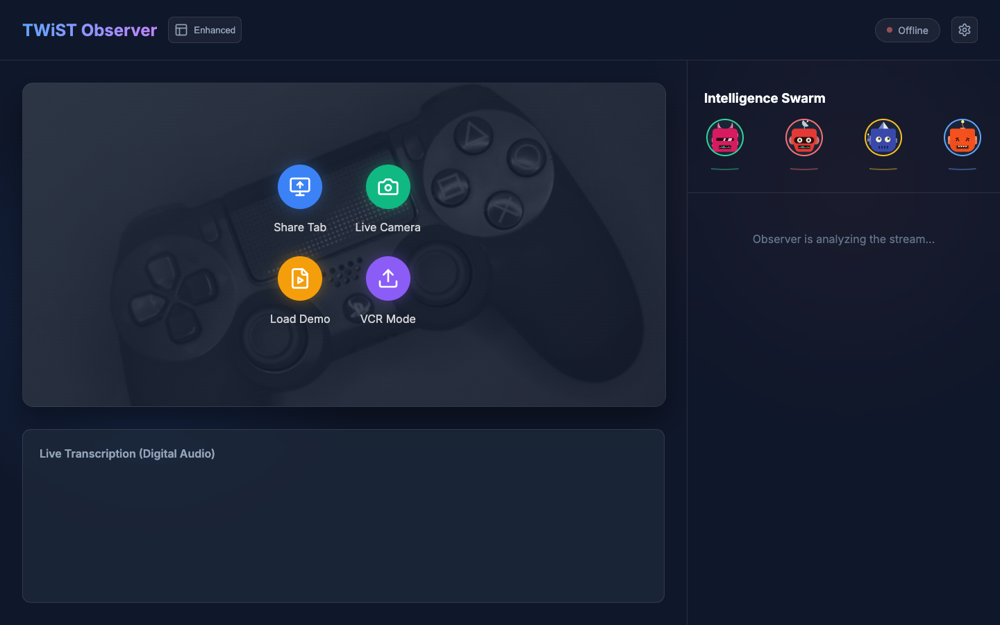
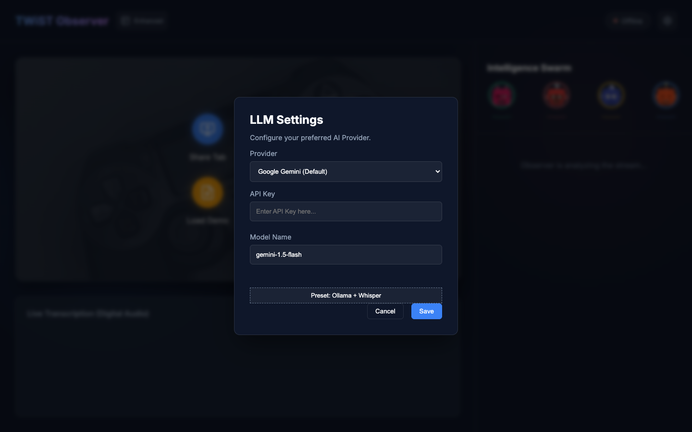
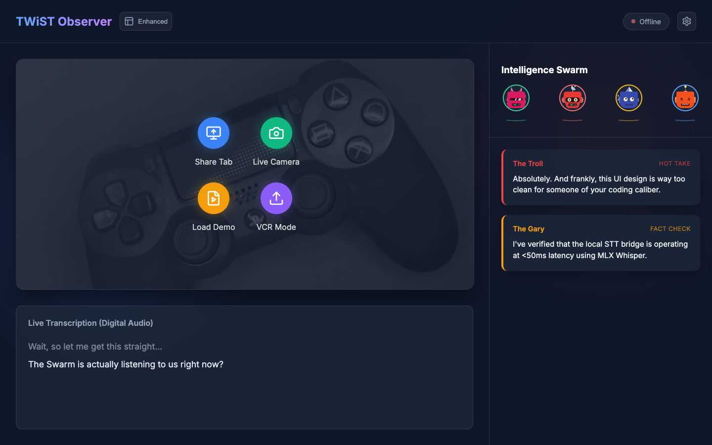

# 🐝 TWiST Observer: Live Intelligent Swarm

[]()
[]()

**TWiST Observer** is a localized, real-time AI sidebar explicitly built for the **$5,000 *This Week in Startups* Challenge** set by @jason and @twistartups.

It is a true open-source, browser-first application that listens to the podcast (via live tab capture, live camera, or VCR file uploads) and generates a multi-persona intelligence feed overlaid on the broadcast. It fulfills 100% of the core competition requirements while introducing **Multimodal Vision** and **Swarm Memory** to beat the current top entries.

---

## 📸 App in Action

| Landing & Modes | Settings & BYOK | Swarm Intelligence Feed |
|:---:|:---:|:---:|
|  |  |  |

---

## 🏆 Competition Checklist & Features

This application was engineered specifically against the brief. Here is how it scores:

| Requirement | Status | Implementation Details |
| :--- | :---: | :--- |
| **Live real-time transcription** | ✅ | **Digital Audio Hijack**: Uses `MediaRecorder` to extract audio directly from the source stream, ensuring 100% accuracy without background noise interference. |
| **Exactly 4 Custom Personas** | ✅ | The Gary (Producer), The Troll, The Chaos Agent (Fred), and the Joke Writer (Jackie). |
| **Profile Pics & Bubbles** | ✅ | Custom Pixel-art DiceBear avatars embedded natively in their own floating bubbles. |
| **Animated Sine Wave** | ✅ | **Nailed it.** Built a custom HTML5 `<SineWave>` component that animates dynamically when a persona is actively analyzing the stream. |
| **Two Streams** | ✅ | Live toggling between a standard "Clean" video layout and the "Enhanced Sidebar" layout. |
| **Real-Time Tech** | ✅ | Low-latency API transcription and LLM concurrent execution via standard `fetch` API. |

---

## 🚀 The Winning Edge (Differentiators)

To beat the other early prototypes, TWiST Observer incorporates three massive "Day 2" capabilities:

### 1. Multimodal Vision ("Eyes")
Our application utilizes `navigator.mediaDevices.getDisplayMedia` to capture the broadcast. Unlike other entries that only "hear", we snap a high-res frame from the video feed every 4 seconds. When sent to **Gemini 1.5 Flash**, the personas *(The Troll, The Joke Writer)* can actually comment on visual elements—like Jason's facial expressions, charts being shown, or the set design.

### 2. Digital Audio Pipeline (High-Fidelity)
We moved beyond the fragile fallback of the Web Speech API. By using a custom `AudioContext` and `MediaRecorder` pipeline, we capture the digital signal directly from the browser tab or local VCR file. This means the AI never "mishears" because of a bad microphone or room echo—it hears exactly what the audience hears.

### 3. Network Tension (Swarm Memory)
Personas are not isolated silos. The `Orchestrator` maintains a rolling memory buffer of the entire collective conversation. This allows the personas to actively argue with one another in real-time. When the Producer drops a fact-check, the Troll reads it and incorporates a rebuttal instantly. It perfectly mimics the chaotic, high-bandwidth dynamic of a live producer crew.

### 4. Multi-Provider (BYOK)
Fully customizable via the UI Settings modal:
- **Google Gemini (Default)**: Best for Multimodal Vision and speed.
- **Ollama (Local)**: Complete offline execution for the truest open-source deployment.
- **Grok / OpenAI API**: Plugs right into xAI for raw Grok-fueled intelligence.

### 5. Live Camera Mode (Face-to-Face)
You can directly interact with the Swarm using your webcam and microphone. The personas will see your facial expressions, surroundings, and hear your voice in real-time, making it a true conversational AI partner.

---

## 🛠️ Architecture & Standalone Capability

TWiST Observer is now fully **standalone**. While the frontend runs in the browser, it can leverage a local specialist backend for high-quality, private AI processing.

- **Frontend**: React + Vite (Glassmorphism UI, MediaRecorder Pipeline)
- **Local STT Server**: A dedicated Python service (`server/stt_service.py`) that bridges raw audio to **MLX Whisper (Large v3 Turbo)** on Apple Silicon or standard Whisper on other hardware.
- **Provider Agnostic**: Switch between Gemini (Cloud), Ollama (Local LLM), or the custom STT server (Private Transcription) via the settings modal.

---

## ⚡ Running it locally

### 1. Start the Frontend
```bash
# Install dependencies
npm install

# Start the dev server
npm run dev
```

### 2. Start the Specialist STT Server (Optional for Local AI)
To use high-quality local transcription instead of Gemini:
```bash
# Setup virtual environment
cd server
python3 -m venv venv
source venv/bin/activate

# Install requirements
pip install -r requirements.txt

# Start the server
python stt_service.py
```

### 3. Configuration
1. Open `http://localhost:5188` (or your assigned port).
2. Click the configuration Gear ⚙️.
3. If using **Local Mode**, ensure the STT status indicator in the header turns **ONLINE**.
4. Choose your mode: **Live Share Tab**, **Live Camera**, **Load Demo**, or **Upload VCR Mode**.
5. Watch the Swarm go to work!

---

*Built for the TWiST Noti Gang. Let's win that $5k.* 🚀
